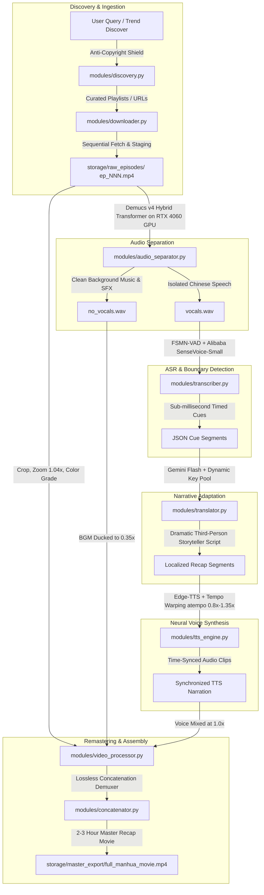

# OneDrama Engine - Comprehensive Architectural & Technical Specification

> **Project Name:** OneDrama Engine  
> **Document Version:** 1.0.0 (Production Architecture)  
> **Target Audience:** Senior Software Engineers, Solution Architects, AI/ML Engineers  
> **System Scope:** Automated Multi-Modal Video Localization, Voice Dubbing, Dynamic Video Remastering, and Full-Length Movie Compilation Engine.

---

## 1. Executive Summary & Problem Statement

### 1.1 The Domain Problem
Chinese dynamic manhua (动态漫画 - motion comics) and web-novels generate tens of billions of views domestically on platforms like **Bilibili**, **Douyin**, and **Kuaishou**. These series are typically released in high-frequency, micro-episodic formats (2 to 4 minutes per episode, spanning 40 to 100+ episodes per story arc). 

Recap channels on YouTube that localize, narrate, and compile these series into 2-to-3-hour cinematic recap movies enjoy massive engagement and high CPM monetization. However, the manual production lifecycle is severely bottlenecked:
- Downloading 50–100 episodes manually from Chinese web APIs is labor-intensive.
- Background music and sound effects (SFX) are hard-baked into original dialogue audio tracks.
- Dialogue translation requires cultural adaptation (cultivation tropes, martial arts systems) rather than literal machine translation.
- Neural Text-to-Speech (TTS) must fit into strict video scene timeframes without audio drift or unnatural desynchronization.
- Copyright Content-ID systems aggressively flag tier-1 mega-donghuas distributed internationally.

### 1.2 The Solution
**OneDrama Engine** is a fully automated, headless CLI and programmatic pipeline that ingests raw episodic video assets and outputs a broadcast-quality, 2–3 hour localized recap movie in target languages (e.g., Hindi, English, Spanish) with zero manual intervention.

---

## 2. System Architecture & Data Pipeline



---

## 3. Core Subsystems & Technical Implementation

### Stage 0: Automated Acquisition & Anti-Copyright Shield
- **Modules:** `modules/discovery.py`, `modules/downloader.py`
- **Anti-Copyright Shield:**
  - Automated heuristic and blocklist filtering against Tier-1 mega-donghua franchises (*Soul Land*, *Battle Through the Heavens*, *Perfect World*, *Swallowed Star*, *A Will Eternal*) and international distributors (*Tencent Video Animation*, *Bilibili International*, *Sparkly Key*).
  - Prioritizes indie domestic dynamic manhua (动态漫画) with high engagement (50K–500K views) that lack international licensing on YouTube.
- **Acquisition Engine:**
  - **Bilibili:** Utilizes `yt-dlp` with customized HTTP Referer and User-Agent headers to bypass HTTP 412 rate-limiting. Fetches multi-part episodes sequentially with zero-padded formatting (`ep_001.mp4`, `ep_002.mp4`...). Integrates `--cookies-from-browser` for VIP-restricted series.
  - **Douyin (Watermark-free API Hack):** Resolves mobile share URLs to raw `aweme_id`, queries internal `iteminfo` endpoints, and replaces `playwm` with `play` to pull raw 1080p camera/render streams devoid of user IDs or floating logos.
  - **Concurrency:** Metadata probing executed concurrently via `concurrent.futures.ThreadPoolExecutor`.

### Stage 1: Neural Vocal Separation & Audio De-mixing
- **Module:** `modules/audio_separator.py`
- **Model:** Meta's **Demucs v4 (Hybrid Transformer / HTDemucs)**.
- **Hardware Acceleration:** Native PyTorch CUDA 12.4 running on **NVIDIA GeForce RTX 4060 Laptop GPU** (8GB GDDR6 VRAM).
- **Execution:** Separates source stereo audio into two discrete stems:
  1. `vocals.wav`: Isolated Chinese character speech used for transcription.
  2. `no_vocals.wav`: Complete ambient bed containing original orchestral score, combat SFX, and atmospheric sound design.
- **Resource Management:** Memory-conscious chunking prevents CUDA OOM on long episode runs; processes intermediate stems in temporary workspaces.

### Stage 2: Fast Acoustic Speech Recognition & Boundary Detection
- **Module:** `modules/transcriber.py`
- **Dual-Engine Architecture:**
  - **Primary Engine (Alibaba SenseVoice-Small + FSMN-VAD):**
    - Non-autoregressive model designed for Chinese speech.
    - Achieves an inference speed of **~0.08x Real-Time Factor (RTF)** (processes a 2-minute dialogue track in ~9 seconds on the RTX 4060).
    - Eliminates the autoregressive repetition/hallucination loops typical of Whisper during musical or silent passages.
    - **FSMN-VAD:** Detects speech/non-speech boundaries with millisecond precision to generate accurate video cue windows.
  - **Fallback Engine:** OpenAI Whisper (`medium` / `large-v3`) with FP16 CUDA acceleration.
- **Post-Processing:** Normalization of overlapping timestamps, hallucination filtering, and emission of standard cue dicts:
  `{"id": int, "start": float, "end": float, "duration": float, "original_text": str}`.

### Stage 3: LLM Dramatic Recap Adaptation & High-Availability Key Pool
- **Module:** `modules/translator.py`
- **Model:** Google Gemini Flash (`gemini-flash-latest`).
- **Narrative Philosophy:**
  - Standard subtitle machine translation produces dry, disorienting 1-to-1 dialogue translations.
  - `OneDrama` instructs the LLM to act as a **dramatic third-person storyteller/narrator** (e.g. *"Xiao Yan realized that his sect had betrayed him, yet his inner flame was already awakening..."*).
  - Incorporates strict brevity constraints so synthesized narration matches the visual pacing of the manhua panels.
- **High-Availability Key Rotation Pool:**
  - Loads a multi-key pool (`gemini_api_keys`) from `config/settings.json`.
  - Implements automatic round-robin and reactive failover: when HTTP 429 (Resource Exhausted) or quota limit is encountered on a key, the client automatically rotates to the next active key without dropping the batch.

### Stage 4: Neural TTS & Pitch-Preserved Time-Scale Modification
- **Module:** `modules/tts_engine.py`
- **Voice Engine:** Microsoft Azure / Edge Neural TTS (`edge-tts`) with high-fidelity multilingual neural voices (e.g., `hi-IN-MadhurNeural`, `en-US-ChristopherNeural`).
- **Dynamic Rubber-Banding / Audio Warping:**
  - Spoken Hindi/English recaps often vary in syllable length compared to compact Chinese source phrases.
  - If synthesized TTS duration exceeds the cue duration, the engine calculates the required tempo factor:
    $$\text{speed} = \text{clamp}\left(\frac{\text{tts\_duration}}{\text{cue\_duration}}, 0.8, 1.35\right)$$
  - Applies FFmpeg's `atempo` filter to dynamically stretch or compress narration audio without altering vocal pitch or causing robotic artifacts.

### Stage 5: Video Remastering & Audio Multiplexing
- **Module:** `modules/video_processor.py`
- **Visual Remastering & Anti-Fingerprinting:**
  - Pan-and-scan slight crop and zoom (1.04x) to defeat automated frame-matching algorithms.
  - Bottom boundary crop (-80px) to eradicate hardcoded Chinese subtitles.
  - Contrast (+5%) and saturation (+8%) grading for enhanced visual punch on AMOLED displays.
- **Audio Mixing (Filtergraph):**
  - Synthesized narration positioned at full gain (`volume=1.0`).
  - Original background music & SFX (`no_vocals.wav`) dynamically ducked to `volume=0.35`.
  - Master composite rendered via FFmpeg (`libx264`, CRF 20, preset `veryfast`, AAC 192kbps).

### Stage 6: Lossless Master Compilation
- **Module:** `modules/concatenator.py`
- **Concatenation Protocol:**
  - Because all episodes are rendered to identical codec specifications (H.264 High Profile, 30fps, 44.1kHz AAC), the concatenator employs the **FFmpeg Concat Demuxer** (`-c copy`).
  - Zero re-encoding overhead: merges 50+ processed episodes into a 2.5-hour movie in under 15 seconds.
  - Supports `--split-compilations` to split series into optimal 2–3 hour YouTube chapters automatically.

---

## 4. Codebase Directory Map

```text
e:/projects/WeeklyProject/OneDrama/one_drama_engine/
│
├── config/
│   └── settings.json          # Master configuration (API key pool, audio mixing, codecs, discovery)
│
├── modules/
│   ├── __init__.py            # PEP 562 lazy submodule importer & shared logging/exec utilities
│   ├── discovery.py           # Bilibili search, anti-copyright shield & trending gem recommender
│   ├── downloader.py          # Sequential Bilibili playlist grabber & Douyin waterless scraper
│   ├── audio_separator.py     # Demucs v4 CUDA vocal/accompaniment stem extractor
│   ├── transcriber.py         # Alibaba SenseVoice-Small + FSMN-VAD & Whisper ASR engine
│   ├── translator.py          # Gemini Flash recap generator with multi-key rotation pool
│   ├── tts_engine.py          # Edge-TTS voice generator with pitch-preserved tempo warper
│   ├── video_processor.py     # FFmpeg video filtergraph, audio ducking & subtitle burner
│   └── concatenator.py        # Lossless FFmpeg concat demuxer & runtime batch planner
│
├── storage/                   # File system workspace (git-ignored)
│   ├── raw_episodes/          # Ingested source video files (ep_001.mp4, ep_002.mp4...)
│   ├── audio_separated/       # Demucs vocal & BGM stems
│   ├── tts_output/            # Synthesized per-segment narration WAVs
│   ├── processed_episodes/    # Fully dubbed and remastered individual episodes
│   └── master_export/         # Final concatenated 2-3 hour movie (full_manhua_movie.mp4)
│
├── pipeline.py                # Master orchestrator & CLI entrypoint
├── requirements.txt           # Production Python dependency manifest
└── .venv/                     # Python 3.11 CPython virtual environment (uv managed)
```

---

## 5. Technology Stack & Infrastructure

| Layer | Component | Specification |
| :--- | :--- | :--- |
| **Runtime** | Python | CPython 3.11.15 (managed via `uv`) |
| **GPU / ML** | PyTorch / CUDA | PyTorch 2.6.0 + CUDA 12.4 (`cu124`) |
| **Hardware** | GPU | NVIDIA GeForce RTX 4060 Laptop GPU (8GB GDDR6 VRAM) |
| **Media Processing** | FFmpeg / FFprobe | FFmpeg 8.1.2 Full Build (`gyan.dev`) |
| **Stem Separation** | Demucs | Demucs v4.1.0 (`htdemucs`) |
| **Speech-to-Text** | FunASR / ModelScope | Alibaba SenseVoice-Small (`iic/SenseVoiceSmall`) + `fsmn-vad` |
| **LLM Reasoning** | Google GenAI SDK | Gemini Flash (`gemini-flash-latest`) |
| **Speech Synthesis** | Edge-TTS | Microsoft Cognitive Services Neural TTS (`edge-tts 7.2.8`) |
| **Web Ingestion** | yt-dlp | yt-dlp 2026.8.19 + custom HTTP header engine |

---

## 6. Resilience, Caching & Error Recovery

1. **Stateful Per-Episode Workspaces:** Each episode manages an isolated directory under `storage/` containing a `workspace.json` receipt.
2. **Deterministic Stage Checkpoints:**
   - `stage_separate`: skips Demucs if `vocals.wav` and `no_vocals.wav` exist and validate via `ffprobe`.
   - `stage_transcribe`: skips ASR if `transcript.json` is cached.
   - `stage_translate`: skips LLM calls if `recap_script.json` is cached.
   - `stage_tts`: skips TTS generation if rendered audio cues match segment counts.
   - `stage_render`: skips FFmpeg composition if `processed_episodes/ep_NNN.mp4` exists.
3. **Graceful Interrupt Handling:** If a network drop or user interrupt (`SIGINT`) occurs during a 50-episode run, re-running `python pipeline.py` immediately resumes from the exact failing step of that episode.
4. **API Quota Protection:** Multi-key pool rotation ensures that overnight batch rendering of 100+ episodes never fails due to free-tier per-minute or per-day rate limits.

---

## 7. Operational CLI Quick Reference

```bash
# 1. Verify pipeline health & dependencies
python pipeline.py --check-env

# 2. Discover trending copyright-safe series from Bilibili
python pipeline.py --discover --genre cultivation

# 3. Search Bilibili for dynamic manhua
python pipeline.py --search "都市修仙"

# 4. Download an entire series into storage/raw_episodes/ (Zero-click)
python pipeline.py --download-series "https://www.bilibili.com/video/BV1xx411c7mD"

# 5. Execute full end-to-end production (CUDA-accelerated)
python pipeline.py

# 6. Run first 3 episodes as a rapid QC test
python pipeline.py --limit 3

# 7. Split massive series into 2-hour movie compilations automatically
python pipeline.py --split-compilations
```
