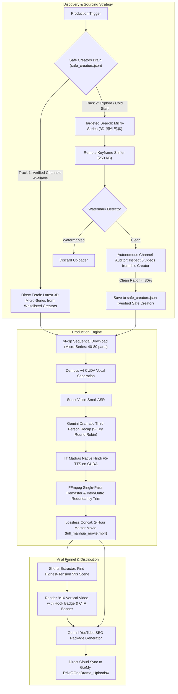

# OneDrama Studio 2.0: Tiered 3D Ingestion, Safe Creators Brain & Viral Shorts Funnel

## Executive Overview
This document specifies the architectural evolution of the OneDrama Engine based on three strategic production pillars:
1. **Tiered Content Sourcing Hierarchy:** Prioritizes **Micro-Series / Short-Form 3D Motion Comics** (1–3 min, 40–100 eps) as our primary production model, followed by Mid-Form (14–15 min), and finally Omnibus Mega-Parts (handled via episodic releases).
2. **Autonomous "Safe Creators Brain" & Dual-Track Scout:** Eliminates random search-and-sniff overhead by autonomously profiling Bilibili creators. Once a clean creator is discovered, the bot audits 5 of their past videos. If clean, the channel is indexed in `storage/safe_creators.json`. The engine prioritizes fetching from this verified pool first (Track 1) while scouting new channels in the background (Track 2).
3. **Automated High-CTR YouTube Shorts Generator:** Automatically carves 1–2 high-drama 59-second vertical (9:16) teaser Shorts from every rendered master movie, complete with hook text badges and pinned-comment Call-to-Action (CTA) directing viewers to the full 2-hour movie.

---

## 🏛️ System Architecture



---

## Proposed Technical Implementation

### Component 1: Content Priority Hierarchy (`modules/discovery.py`)
- Define strict priority order:
  - **Tier 1 (PRIMARY):** Micro-Series / 3D Dynamic Manhua (`3D 漫剧 / 3D 动态漫`) — 1 to 3 minutes, 30 to 100 episodes.
  - **Tier 2 (SECONDARY):** Mid-Form Episodic Arc — 12 to 20 minutes, 10 to 20 episodes.
  - **Tier 3 (TERTIARY):** Omnibus Mega-Parts — 45 to 120 minutes (processed as sequential `Part 1`, `Part 2`...).
- In `modules/discovery.py`, default search queries strictly prioritize Tier 1 keywords:
  - `3D 漫剧 纯享`
  - `3D 动态漫 爽文`
  - `微短剧 3D 动画 纯享`

---

### Component 2: Autonomous Safe Creators Brain (`modules/channel_scout.py`)
- **Storage:** `storage/safe_creators.json`
- **Schema:**
  ```json
  {
    "creators": {
      "mid_18492019": {
        "name": "青木漫社",
        "mid": "18492019",
        "space_url": "https://space.bilibili.com/18492019",
        "total_audited": 5,
        "clean_count": 5,
        "clean_ratio": 1.0,
        "is_safe": true,
        "primary_format": "micro_series_3d",
        "last_audited": "2026-09-05",
        "known_series": ["BV1...", "BV2..."]
      }
    }
  }
  ```
- **Auditing Workflow:**
  1. When a clean candidate video is discovered, extract `uploader_mid`.
  2. If `uploader_mid` is not yet indexed, fetch their 5 latest video URLs using yt-dlp flat playlist.
  3. Sniff 2-second keyframe slices from those 5 videos.
  4. If $\ge 80\%$ are clean without watermarks and free from tier-1 copyright titles, badge the creator as `VERIFIED_SAFE`.
  5. Subsequent discovery cycles query verified safe creators first, bypassing random sniffing entirely!

---

### Component 3: Automated Viral YouTube Shorts Generator (`modules/shorts_generator.py`)
- **Input:** `full_manhua_movie.mp4` or individual processed episodes + `recap_script.json`.
- **Tension Detection:**
  - Scans `recap_script.json` for emotional and dramatic power words (*"kiss", "betrayal", "awakening", "shock", "reincarnation", "slap"*).
  - Selects the most gripping 50–58 second window.
- **Visual Composition (FFmpeg 9:16 Canvas):**
  - Background: Centered video scaled to fill $1080 \times 1920$ with heavy blur (`boxblur=20:5`).
  - Foreground: Crisp $1080 \times 608$ original 16:9 frame centered vertically.
  - Top Overlay: High-contrast yellow/white text hook badge (e.g. *"SHE KISSED HIM IN CLASS?! 😱 PART 1"*).
  - Bottom Overlay: Call to Action (*"Full 2-Hour Movie Link in Pinned Comment 🔗"*).
- **Export:** Saved in `storage/master_export/shorts/` and automatically synced to `G:\My Drive\OneDrama_Uploads\`.

---

### Component 4: Pipeline CLI Integration (`pipeline.py`)
- Add CLI options:
  - `--source-priority {micro,mid,mega}`: Enforces tier ordering (default: `micro`).
  - `--sync-safe-creators`: Trigger autonomous channel auditing and updates `safe_creators.json`.
  - `--generate-shorts`: Automatically render 1-2 vertical YouTube Shorts from the master movie.

---

## Verification & Deployment Plan
1. **Channel Scout Verification:** Run `channel_scout.py` on an uploader to confirm 5-video keyframe sniffing, clean ratio calculation, and saving to `safe_creators.json`.
2. **Shorts Generator Test:** Carve a 50-second 9:16 teaser from today's rendered 6-minute movie (`full_manhua_movie.mp4`), verify vertical layout, blur background, and audio sync.
3. **End-to-End Pipeline Run:** Verify full run with `--generate-shorts` automatically exports master movie + Shorts + metadata to Google Drive.
